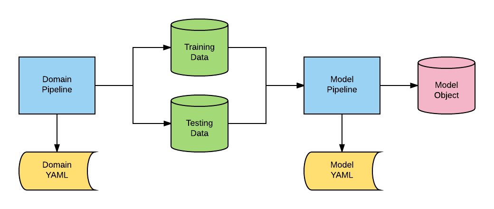

Introduction
============

**AlphaPy** is a machine learning framework for both speculators and
data scientists. It is written in Python with the ``scikit-learn``
and ``pandas`` libraries, as well as many other helpful libraries
for feature engineering and visualization. Here are just some of the
things you can do with AlphaPy:

* Run machine learning models using ``scikit-learn`` and ``xgboost``.
* Create models for analyzing the markets with *MarketFlow*.
* Predict sporting events with *SportFlow*.
* Develop trading systems and analyze portfolios using *MarketFlow*
  and Quantopian's ``pyfolio``.

The ``alphapy`` package is the base platform. The *domain* pipelines
MarketFlow (``mflow``) and SportFlow (``sflow``) run on top of
``alphapy``. As shown in the diagram below, we separate the domain
pipeline from the model pipeline. The main job of a domain pipeline
is to transform the raw application data into canonical form, i.e.,
a training set and a testing set. The model pipeline is flexible
enough to handle any project and evolved over many Kaggle
competitions.

Let's review all of the components in the diagram:

``Domain Pipeline``:
    This is the Python code that creates the standard training and
    testing data. For example, you may be combining different data
    frames or collecting time series data from an external feed.
    These data are transformed for input into the model pipeline.

``Domain YAML``: 
    AlphaPy uses configuration files written in YAML to give the
    data scientist maximum flexibility. Typically, you will have
    a standard YAML template for each domain or application.

``Training Data``: 
    The training data is an external file that is read as a
    pandas dataframe. For classification, one of the columns will
    represent the target or dependent variable.

``Testing Data``:  
    The testing data is an external file that is read as a pandas
    dataframe. For classification, the labels may or may not be
    included.

``Model Pipeline``: 
    This Python code is generic for running all classification or
    regression models. The pipeline begins with data and ends with
    a model object for new predictions.

``Model YAML``: 
    The configuration file has specific sections for running the
    model pipeline. Every aspect of creating a model is controlled
    through this file.

``Model Object``: 
    All models are saved to disk. You can load and run your trained
    model on new data in scoring mode.

Core Functionality
------------------

**AlphaPy** has been developed primarily for supervised learning
tasks. You can generate models for any classification or regression
problem.

* Binary Classification: classify elements into one of two groups
* Multiclass Classification: classify elements into multiple categories
* Regression: predict real values based on derived coefficients

Classification Algorithms:

* AdaBoost
* Extra Trees
* Gradient Boosting
* K-Nearest Neighbors
* Logistic Regression
* Support Vector Machine (including Linear)
* Naive Bayes (including Multinomial)
* Radial Basis Functions
* Random Forests
* XGBoost Binary and Multiclass

Regression Algorithms:

* Extra Trees
* Gradient Boosting
* K-Nearest Neighbor
* Linear Regression
* Random Forests
* XGBoost

External Packages
-----------------

**AlphaPy** relies on a number of key packages in both its model and
domain pipelines. Although most packages are included in the Anaconda
Python platform, most of the following packages are not, so please
refer to the Web or Github site for further information.

* categorical-encoding: https://github.com/scikit-learn-contrib/categorical-encoding
* imbalanced-learn: https://github.com/scikit-learn-contrib/imbalanced-learn
* pyfolio: https://github.com/quantopian/pyfolio
* XGBoost: https://github.com/dmlc/xgboost
