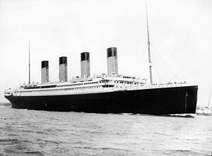
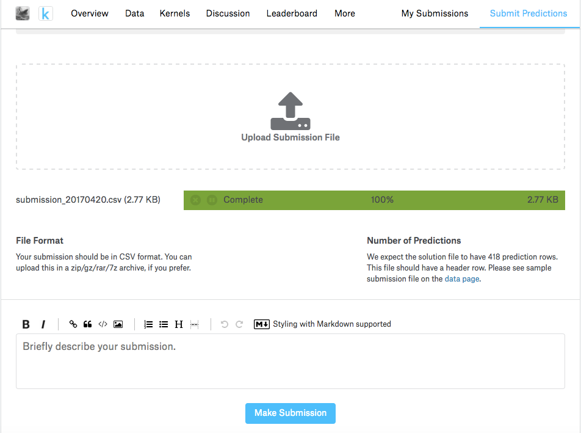

Kaggle Tutorial
===============

*AlphaPy Running Time: Approximately 2 minutes*

The most popular introductory project on Kaggle is Titanic_,
in which you apply machine learning to predict which passengers
were most likely to survive the sinking of the famous ship.
In this tutorial, we will run AlphaPy to train a model,
generate predictions, and create a submission file so you can
see where you land on the Kaggle leaderboard.

.. _Titanic: https://www.kaggle.com/c/titanic

.. note:: AlphaPy is a good starter for most Kaggle competitions.
   We also use it for other competitions such as the crowd-sourced
   hedge fund Numerai_.

.. _Numerai: https://numer.ai/leaderboard

**Step 1**: From the ``examples`` directory, change your directory::

    cd Kaggle

Before running AlphaPy, let's briefly review the ``model.yml``
file in the ``config`` directory. We will submit the actual
predictions (1 vs. 0) instead of the probabilities, so
``submit_probas`` is set to ``False``. All features will be
included except for the ``PassengerId``. The target variable
is ``Survived``, the label we are trying to accurately predict.

We'll compare random forests and XGBoost, run recursive
feature elimination and a grid search, and select the best
model. Note that a blended model of all the algorithms is
a candidate for best model. The details of each algorithm
are located in the ``algos.yml`` file.

.. literalinclude:: titanic.yml
   :language: yaml
   :caption: **model.yml**

**Step 2**: Now, we are ready to run AlphaPy. Enter the
following command::

    alphapy

As ``alphapy`` runs, you will see the progress of the workflow,
and the logging output is saved in ``alphapy.log``. When the
workflow completes, your project structure will look like this,
with a different datestamp::

    Kaggle
    ├── alphapy.log
    ├── config
        ├── algos.yml
        ├── model.yml
    └── data
    └── input
        ├── test.csv
        ├── train.csv
    └── model
        ├── feature_map_20170420.pkl
        ├── model_20170420.pkl
    └── output
        ├── predictions_20170420.csv
        ├── probabilities_20170420.csv
        ├── rankings_20170420.csv
        ├── submission_20170420.csv
    └── plots
        ├── calibration_train.png
        ├── confusion_train_RF.png
        ├── confusion_train_XGB.png
        ├── feature_importance_train_RF.png
        ├── feature_importance_train_XGB.png
        ├── learning_curve_train_RF.png
        ├── learning_curve_train_XGB.png
        ├── roc_curve_train.png

**Step 3**: To see how your model ranks on the Kaggle leaderboard,
upload the submission file from the ``output`` directory to the
Web site https://www.kaggle.com/c/titanic/submit.

