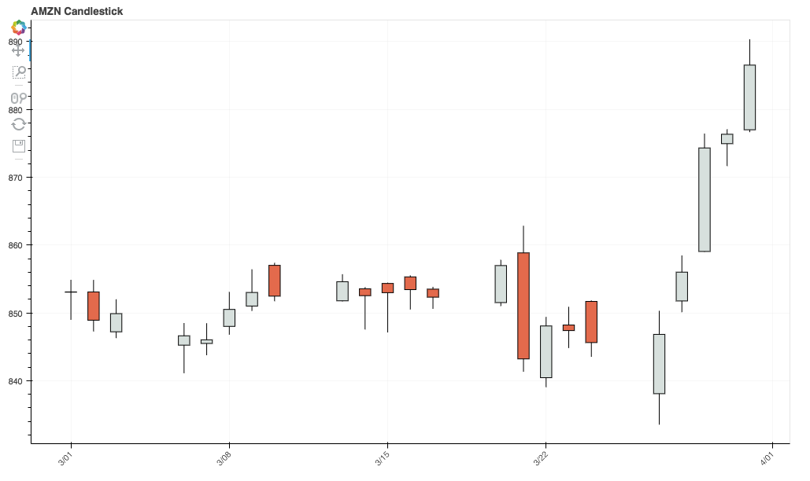
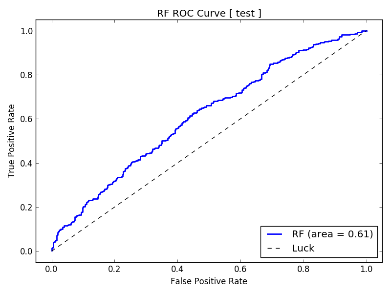
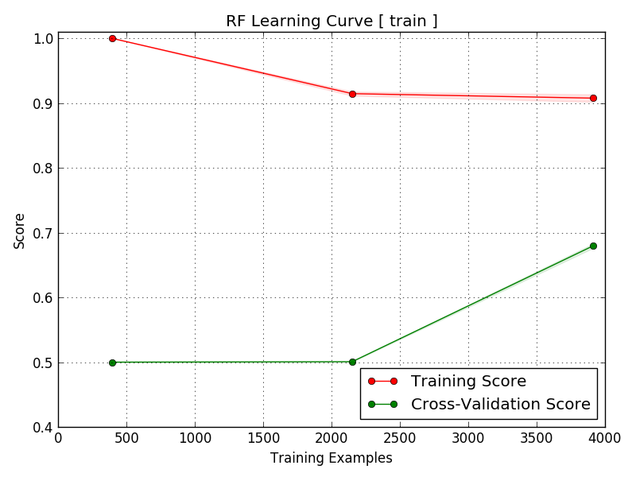
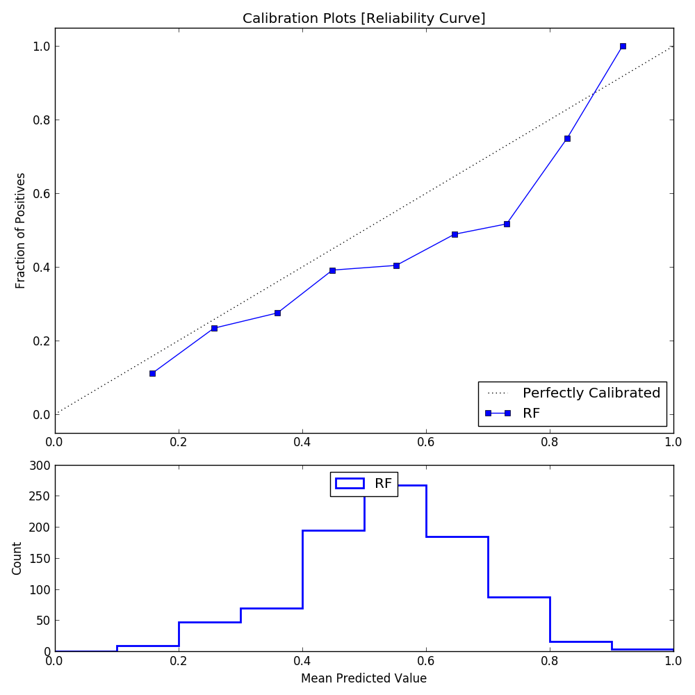

Market Prediction Tutorial
==========================

*MarketFlow Running Time: Approximately 6 minutes*

Machine learning subsumes *technical analysis* because collectively,
technical analysis is just a set of features for market prediction.
We can use machine learning as a feature blender for moving averages,
indicators such as RSI and ADX, and even representations of chart
formations such as double tops and head-and-shoulder patterns.

We are not directly predicting net return in our models, although
that is the ultimate goal. By characterizing the market with models,
we can increase the Return On Investment (ROI). We have a wide range
of dependent or target variables from which to choose, not just net
return. There is more power in building a classifier rather than a
more traditional regression model, so we want to define binary
conditions such as whether or not today is going to be a trend day,
rather than a numerical prediction of today’s return.

In this tutorial, we will train a model that predicts whether or
not the next day will have a larger-than-average range. This is
important for deciding which system to deploy on the prediction
day. If our model gives us predictive power, then we can filter
out those days where trading a given system is a losing strategy.

**Step 1**: From the ``examples`` directory, change your
directory::

    cd "Trading Model"

Before running MarketFlow, let's briefly review the configuration
files in the ``config`` directory:

``market.yml``:
    The MarketFlow configuration file

``model.yml``:
    The AlphaPy configuration file

In ``market.yml``, we limit our model to six stocks in the target
group ``test``, going back 2000 trading days. You can define any
group of stock symbols in the ``groups`` section, and then set
the ``target_group`` attribute in the ``market`` section to the
name of that group.

This is a 1-day forecast, but we also use those features that can
be calculated at the market open, such as gap information in the
``leaders`` section. In the ``features`` section, we define many
variables for moving averages, historical range, RSI, volatility,
and volume.

.. literalinclude:: rrover_market.yml
   :language: yaml
   :caption: **market.yml**

In each of the tutorials, we experiment with different options in
``model.yml`` to run AlphaPy. Here, we first apply univariate feature
selection and then run a random forest classifier with Recursive
Feature Elimination, including Cross-Validation (RFECV). When you
choose RFECV, the process takes much longer, so if you want to see
more logging, then increase the ``verbosity`` level in the ``pipeline``
section.

Since stock prices are time series data, we apply the ``runs_test``
function to twelve features in the ``treatments`` section. Treatments
are powerful because you can write any function to extrapolate new
features from existing ones. AlphaPy provides some of these functions
in the ``alphapy.features`` module, but it can also import external
functions as well.

Our target variable is ``rrover``, the ratio of the 1-day range to
the 10-day average high/low range. If that ratio is greater than
or equal to 1.0, then the value of ``rrover`` is True. This is
what we are trying to predict.

.. literalinclude:: rrover_model.yml
   :language: yaml
   :caption: **model.yml**

**Step 2**: Now, let's run MarketFlow::

    mflow --pdate 2017-10-01

As ``mflow`` runs, you will see the progress of the workflow,
and the logging output is saved in ``market_flow.log``. When the
workflow completes, your project structure will look like this,
with a different datestamp::

    Trading Model
    ├── market_flow.log
    ├── config
        ├── algos.yml
        ├── market.yml
        ├── model.yml
    └── data
    └── input
        ├── test_20170420.csv
        ├── test.csv
        ├── train_20170420.csv
        ├── train.csv
    └── model
        ├── feature_map_20170420.pkl
        ├── model_20170420.pkl
    └── output
        ├── predictions_20170420.csv
        ├── probabilities_20170420.csv
        ├── rankings_20170420.csv
    └── plots
        ├── calibration_test.png
        ├── calibration_train.png
        ├── confusion_test_RF.png
        ├── confusion_train_RF.png
        ├── feature_importance_train_RF.png
        ├── learning_curve_train_RF.png
        ├── roc_curve_test.png
        ├── roc_curve_train.png

Let's look at the results in the ``plots`` directory. Since our
scoring function was ``roc_auc``, we examine the ROC Curve first.
The AUC is approximately 0.61, which is not very high but in the
context of the stock market, we may still be able to derive
some predictive power. Further, we are running the model on a
relatively small sample of stocks, as denoted by the jittery
line of the ROC Curve.

We can benefit from more samples, as the learning curve shows
that the training and cross-validation lines have yet to converge.

The good news is that even with a relatively small number of
testing points, the Reliability Curve slopes upward from left
to right, with the dotted line denoting a perfect classifier.

To get better accuracy, we can raise our threshold to find the
best candidates, since they are ranked by probability, but this
also means limiting our pool of stocks. Let's take a closer
look at the rankings file.

**Step 3**: From the command line, enter::

    jupyter notebook

**Step 4**: Click on the notebook named::

    A Trading Model.ipynb

**Step 5**: Run the commands in the notebook, making sure that
when you read in the rankings file, change the date to match
the result from the ``ls`` command.

``Conclusion`` We can predict large-range days with some confidence,
but only at a higher probability threshold. This is important for
choosing the correct system on any given day. We can achieve
better results with more data, so we recommend expanding the
stock universe, e.g., a group with at least 100 members going
five years back.
