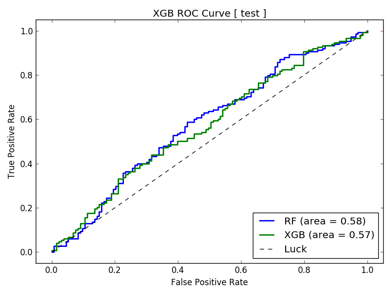

NCAA Basketball Tutorial
========================

*SportFlow Running Time: Approximately 15 minutes*

In this tutorial, we use machine learning to predict whether
or not an NCAA Men's Basketball team will cover the *spread*.
The spread is set by Las Vegas bookmakers to balance the betting;
it is a way of giving points to the underdog to encourage bets
on both sides.

SportFlow starts with the basic data and derives time series
features based on streaks and runs (not the baseball runs).
In the table below, the game data includes both *line* and
*over_under* information consolidated from various sports Web sites.
For example, a line of -9 means the home team is favored by 9 points.
A line of +3 means the away team is favored by 3 points; the line
is always relative to the home team. An over_under is the predicted
total score for the game, with a bet being placed on whether not
the final total will be under or over that amount.

.. csv-table:: NCAA Basketball Data
   :file: ncaa.csv

**Step 1**: First, from the ``examples`` directory, change your
directory::

    cd NCAAB

Before running SportFlow, let's briefly review the configuration
files in the ``config`` directory:

``sport.yml``:
    The SportFlow configuration file

``model.yml``:
    The AlphaPy configuration file

In ``sport.yml``, the first three items are used for ``random_scoring``,
which we will not be doing here. By default, we will create a model
based on all ``seasons`` and calculate short-term streaks of 3 with
the ``rolling_window``.

.. literalinclude:: ncaab_sport.yml
   :language: yaml
   :caption: **sport.yml**

In each of the tutorials, we experiment with different options in
``model.yml`` to run AlphaPy. Here, we will run a random forest
classifier with Recursive Feature Elimination and Cross-Validation
(RFECV), and then an XGBoost classifier. We will also perform a
random grid search, which increases the total running time to
approximately 15 minutes. You can get in some two-ball dribbling
while waiting for SportFlow to finish.

In the ``features`` section, we identify the ``factors`` generated
by SportFlow. For example, we want to treat the various streaks
as factors. Other options are ``interactions``, standard ``scaling``,
and a ``threshold`` for removing low-variance features.

Our target variable is ``won_on_spread``, a Boolean indicator of
whether or not the home team covered the spread. This is what we
are trying to predict.

.. literalinclude:: ncaab_model.yml
   :language: yaml
   :caption: **model.yml**

**Step 2**: Now, let's run SportFlow::

    sflow --pdate 2016-03-01

As ``sflow`` runs, you will see the progress of the workflow,
and the logging output is saved in ``sport_flow.log``. When the
workflow completes, your project structure will look like this,
with a different datestamp::

    NCAAB
    ├── sport_flow.log
    ├── config
        ├── algos.yml
        ├── sport.yml
        ├── model.yml
    └── data
        ├── ncaab_game_scores_1g.csv
    └── input
        ├── test.csv
        ├── train.csv
    └── model
        ├── feature_map_20170427.pkl
        ├── model_20170427.pkl
    └── output
        ├── predictions_20170427.csv
        ├── probabilities_20170427.csv
        ├── rankings_20170427.csv
    └── plots
        ├── calibration_test.png
        ├── calibration_train.png
        ├── confusion_test_RF.png
        ├── confusion_test_XGB.png
        ├── confusion_train_RF.png
        ├── confusion_train_XGB.png
        ├── feature_importance_train_RF.png
        ├── feature_importance_train_XGB.png
        ├── learning_curve_train_RF.png
        ├── learning_curve_train_XGB.png
        ├── roc_curve_test.png
        ├── roc_curve_train.png

Depending upon the model parameters and the prediction date,
the AUC of the ROC Curve will vary between 0.54 and 0.58.
This model is barely passable, but we are getting a slight
edge even with our basic data. We will need more game samples
to have any confidence in our predictions.

After a model is created, we can run ``sflow`` in ``predict``
mode. Just specify the prediction date ``pdate``, and SportFlow
will make predictions for all cases in the ``predict.csv`` file
on or after the specified date. Note that the ``predict.csv``
file is generated on the fly in predict mode and stored in the
``input`` directory.

**Step 3**: Now, let's run SportFlow in predict mode, where all
results will be stored in the ``output`` directory::

    sflow --predict --pdate 2016-03-15

``Conclusion`` Even with just one season of NCAA Men's Basketball
data, our model predicts between 52-54% accuracy. To attain
better accuracy, we need more historical data vis a vis the
number of games and other types of information such as individual
player statistics. If you want to become a professional bettor,
then you need at least 56% winners to break the bank.
