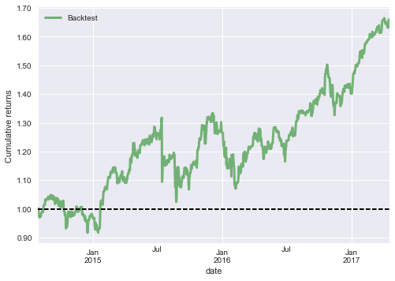
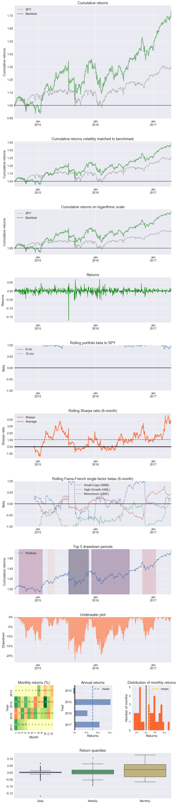

Trading System Tutorial
=======================

*MarketFlow Running Time: Approximately 1 minute*

A trading system is a set of automated rules for buying and selling
stocks, options, futures, and other instruments. Trading is considered
to be both an art and a science; the scientific branch is known as
*technical analysis*. Many technicians spend their lives chasing the
Holy Grail: a system that will make them rich simply by detecting
common patterns. Technicians in history such as Edwards, Elliott,
Fibonacci, Gann, and Gartley show us visually appealing charts,
but there is no scientific evidence proving that these techniques
actually work.

Trading systems generally operate in two contexts: trend and
counter-trend. A system that follows the trend tries to stay in
one direction as long as possible. A system that bucks the trend
reverses direction at certain support and resistance levels, also
known as fading the trend. With MarketFlow, you can implement
either type of system using our long/short strategy.

In this tutorial, we are going to test a simple long/short system.
If today's closing price is greater than yesterday's close, then
we go long. If today's close is lower than yesterday's, then we 
go short, so we always have a position in the market.

**Step 1**: From the ``examples`` directory, change your directory::

    cd "Trading System"

Before running MarketFlow, let's review the ``market.yml`` file
in the ``config`` directory. Since we are just running a system,
we really don't need the ``model.yml`` file, but if you have a
project where the system is derived from a model, then you will
want to maintain both files.

In ``market.yml``, we will test our system on five stocks in the
target group ``faang``, going back 1000 trading days. We need
to define only two features: ``hc`` for higher close, and ``lc``
for lower close. We name the system ``closer``, which requires
just a ``longentry`` and a ``shortentry``. There are no exit
conditions and no holding period, so we will always have a position
in each stock.

.. literalinclude:: closer_market.yml
   :language: yaml
   :caption: **market.yml**

**Step 2**: Now, let's run MarketFlow::

    mflow

As ``mflow`` runs, you will see the progress of the workflow,
and the logging output is saved in ``market_flow.log``. When the
workflow completes, your project structure will look like this,
with an additional directory ``systems``::

    Trading System
    ├── market_flow.log
    ├── config
        ├── algos.yml
        ├── market.yml
        ├── model.yml
    └── data
    └── input
    └── model
    └── output
    └── plots
    └── systems
        ├── faang_closer_positions_1d.csv
        ├── faang_closer_returns_1d.csv
        ├── faang_closer_trades_1d.csv
        ├── faang_closer_transactions_1d.csv

MarketFlow records position, return, and transaction data in the
``systems`` directory, so now we can analyze our results with
*Pyfolio*. 

**Step 3**: From the command line, enter::

    jupyter notebook

**Step 4**: Click on the notebook named::

    A Trading System.ipynb

You should obtain the following results in your notebook.

