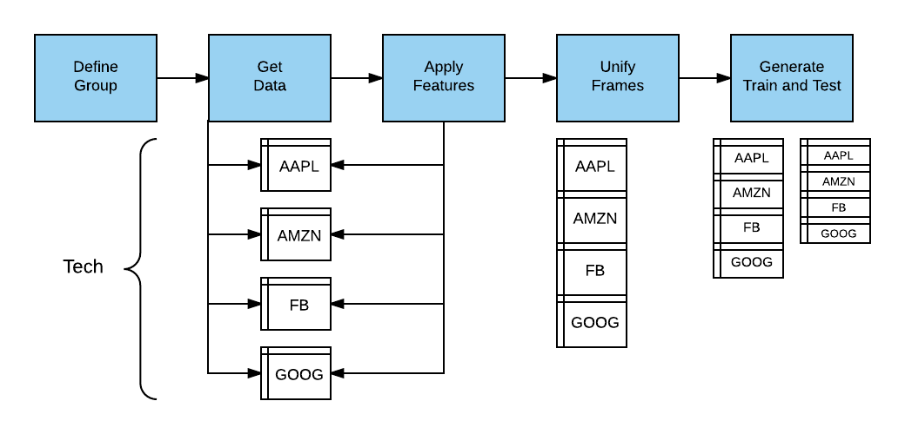
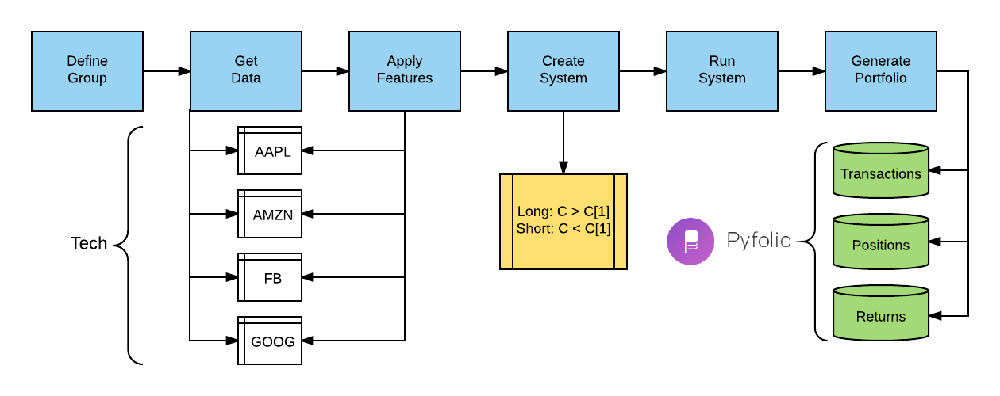

MarketFlow
==========

**MarketFlow** transforms financial market data into machine learning
models for making market predictions. The platform gets stock price
data from Yahoo Finance (end-of-day) and Google Finance (intraday),
transforming the data into canonical form for training and testing.
MarketFlow is powerful because you can easily apply new features
to groups of stocks simultaneously using our *Variable Definition
Language* (VDL). All of the dataframes are aggregated and split
into training and testing files for input into *AlphaPy*.

Data Sources
------------

MarketFlow gets daily stock prices from Yahoo Finance and intraday
stock prices from Google Finance. Both data sources have the standard
primitives: ``Open``, ``High``, ``Low``, ``Close``, and ``Volume``.
For daily data, there is a ``Date`` timestamp and for intraday data,
there is a ``Datetime`` timestamp. We augment the intraday data with
a ``bar_number`` field to mark the end of the trading day. All trading
days do not end at 4:00 pm EST, as there are holiday trading days
that are shortened.

.. csv-table:: Amazon Daily Stock Prices (Source: Yahoo)
   :file: amzn_daily.csv

.. note:: Normal market hours are 9:30 am to 4:00 pm EST. Here, we
   retrieved the data from the CST time zone, one hour ahead.

.. csv-table:: Amazon Intraday Stock Prices (Source: Google)
   :file: amzn_intraday.csv

.. note:: You can get Google intraday data going back a maximum of
   50 days. If you want to build your own historical record, then
   we recommend that you save the data on an ongoing basis for a
   a larger backtesting window.

Domain Configuration
--------------------

The market configuration file (``market.yml``) is written in YAML
and is divided into logical sections reflecting different parts
of **MarketFlow**. This file is stored in the ``config`` directory
of your project, along with the ``model.yml`` and ``algos.yml`` files.
The ``market`` section has the following parameters:

``data_history``:  
    Number of periods of historical data to retrieve.

``forecast_period``:
    Number of periods to forecast for the target variable.

``fractal``: 
    The time quantum for the data feed, represented by an integer
    followed by a character code. The string "1d" is one day, and
    "5m" is five minutes.

``leaders``: 
    A list of features that are coincident with the target variable.
    For example, with daily stock market data, the ``Open`` is
    considered to be a leader because it is recorded at the market
    open. In contrast, the daily ``High`` or ``Low`` cannot be
    known until the the market close.

``predict_history``: 
    This is the minimum number of periods required to derive all
    of the features in prediction mode on a given date. If you use
    a rolling mean of 50 days, then the ``predict_history`` should
    be set to at least 50 to have a valid value on the prediction
    date.

``schema``: 
    This string uniquely identifies the subject matter of the data.
    A schema could be ``prices`` for identifying market data.

``target_group``:  
    The name of the group selected from the ``groups`` section,
    e.g., a set of stock symbols.

.. literalinclude:: market.yml
   :language: yaml
   :caption: **market.yml**

Group Analysis
--------------

The cornerstone of MarketFlow is the *Analysis*. You can create
models and forecasts for different groups of stocks. The purpose
of the analysis object is to gather data for all of the group
members and then consolidate the data into train and test files.
Further, some features and the target variable have to be adjusted
(lagged) to avoid data leakage.

A group is simply a collection of symbols for analysis. In this
example, we create different groups for technology stocks, ETFs,
and a smaller group for testing. To create a model for a given
group, simply set the ``target_group`` in the ``market`` section
of the market.yml file and run ``mflow``.

.. literalinclude:: market.yml
   :language: yaml
   :caption: **market.yml**
   :lines: 10-51

Variables and Aliases
---------------------

Because market analysis encompasses a wide array of technical indicators,
you can define features using the *Variable Definition Language* (VDL).
The concept is simple: flatten out a function call and its parameters
into a string, and that string represents the variable name. You can
use the technical analysis functions in AlphaPy, or define your own.

Let's define a feature that indicates whether or not a stock is above
its 50-day closing moving average. The *alphapy.market_variables*
module has a function ``ma`` to calculate a rolling mean. It has two
parameters: the name of the dataframe's column and the period over
which to calculate the mean. So, the corresponding variable name is
``ma_close_50``.

Typically, a moving average is calculated with the closing price,
so we can define an alias ``cma`` which represents the closing
moving average. An alias is simply a substitution mechanism for
replacing one string with an abbreviation. Instead of ``ma_close_50``,
we can now refer to ``cma_50`` using an alias.

Finally, we can define the variable ``abovema`` with a relational
expression. Note that numeric values in the expression can be
substituted when defining features, e.g., ``abovema_20``.

.. code-block:: yaml
   :caption: **market.yml**

   features: ['abovema_50']

   aliases:
       cma        : 'ma_close'

   variables:
       abovema    : 'close > cma_50'

Here are more examples of aliases.

.. literalinclude:: market.yml
   :language: yaml
   :caption: **market.yml**
   :lines: 71-104

Variable expressions are valid Python expressions, with the addition
of offsets to reference previous values.

.. literalinclude:: market.yml
   :language: yaml
   :caption: **market.yml**
   :lines: 106-134

Once the aliases and variables are defined, a foundation is established
for defining all of the features that you want to test. 

.. literalinclude:: market.yml
   :language: yaml
   :caption: **market.yml**
   :lines: 53-69

Trading Systems
---------------

MarketFlow provides two out-of-the-box trading systems. The first is
a long/short system that you define using the system features in the
configuration file ``market.yml``. When MarketFlow detects a system
in the file, it knows to execute that particular long/short strategy.

.. literalinclude:: system.yml
   :language: yaml
   :caption: **market.yml**

``name``:  
    Unique identifier for the trading system.

``holdperiod``:
    Number of periods to hold an open position.

``longentry``: 
    A conditional feature to establish when to open a long position.

``longexit``: 
    A conditional feature to establish when to close a long position.

``shortentry``: 
    A conditional feature to establish when to open a short position.

``shortexit``: 
    A conditional feature to establish when to close a short position.

``scale``:  
    When ``True``, add to a position in the same direction. The default
    action is not to scale positions.

The second system is an *open range breakout* strategy. The premise
of the system is to wait for an established high-low range in the
first n minutes (e.g., 30) and then wait for a breakout of either
the high or the low, especially when the range is relatively
narrow. Typically, a stop-loss is set at the other side of the
breakout range.

After a system runs, four output files are stored in the ``system``
directory; the first three are formatted for analysis by Quantopian's
**pyfolio** package. The last file is the list of trades generated
by MarketFlow based on the system specifications.

* [group]_[system]_transactions_[fractal].csv
* [group]_[system]_positions_[fractal].csv
* [group]_[system]_returns_[fractal].csv
* [group]_[system]_trades_[fractal].csv

If we developed a moving average crossover system on daily data for
technology stocks, then the trades file could be named:

    tech_xma_trades_1d.csv

The important point here is to reserve a namespace for different
combinations of groups, systems, and fractals to compare performance
over space and time.

Model Configuration
-------------------

MarketFlow runs on top of AlphaPy, so the ``model.yml`` file has
the same format. In the following example, note the use of treatments
to calculate runs for a set of features.

.. literalinclude:: market_model.yml
   :language: text
   :caption: **model.yml**

Creating the Model
------------------

First, change the directory to your project location,
where you have already followed the :doc:`../user_guide/project`
specifications::

    cd path/to/project

Run this command to train a model::

    mflow

Usage::

    mflow [--train | --predict] [--tdate yyyy-mm-dd] [--pdate yyyy-mm-dd]

--train     Train a new model and make predictions (Default)
--predict   Make predictions from a saved model
--tdate     The training date in format YYYY-MM-DD (Default: Earliest Date in the Data)
--pdate     The prediction date in format YYYY-MM-DD (Default: Today's Date)

Running the Model
-----------------

In the project location, run ``mflow`` with the ``predict`` flag.
MarketFlow will automatically create the ``predict.csv`` file using
the ``pdate`` option::

    mflow --predict [--pdate yyyy-mm-dd]
