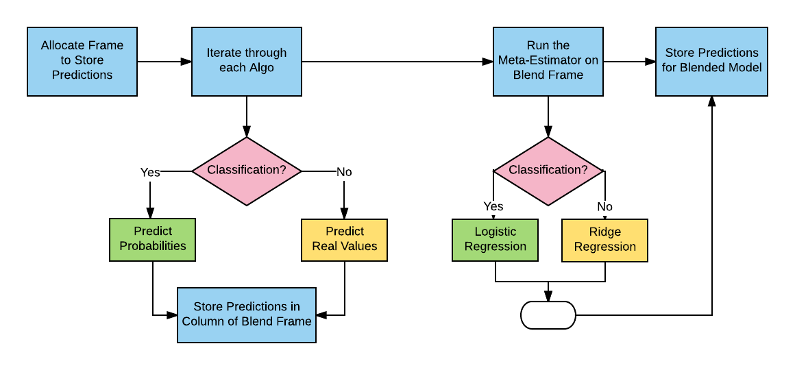
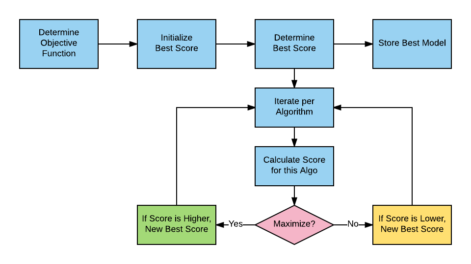
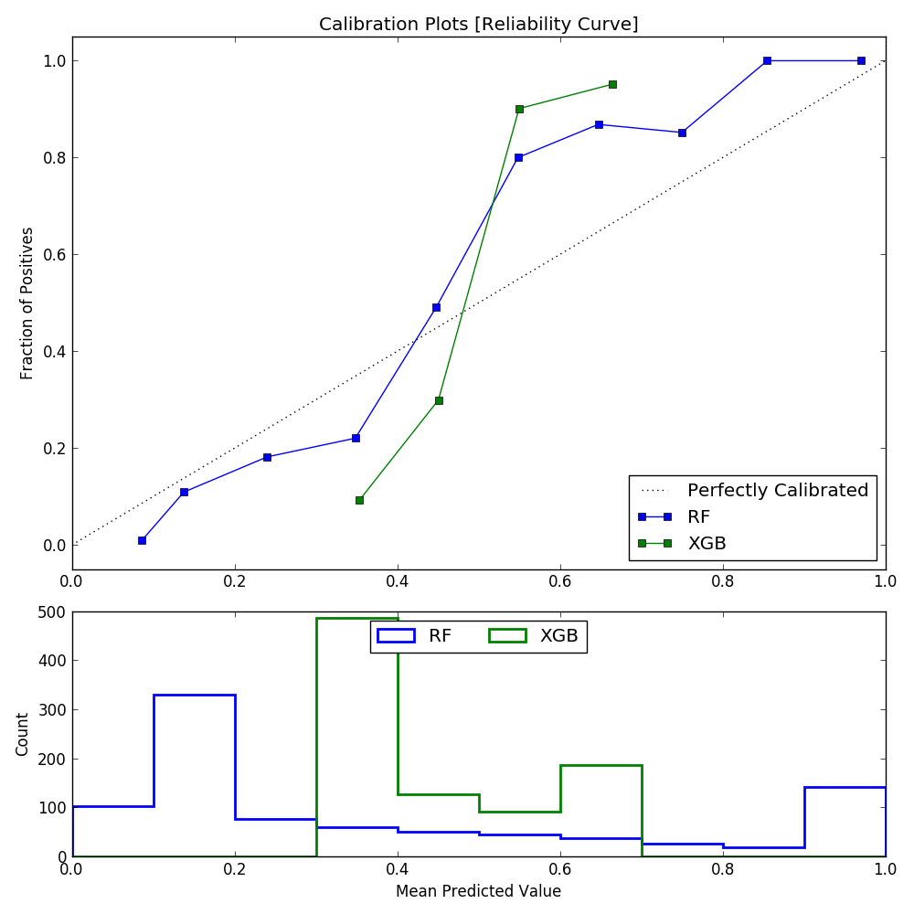
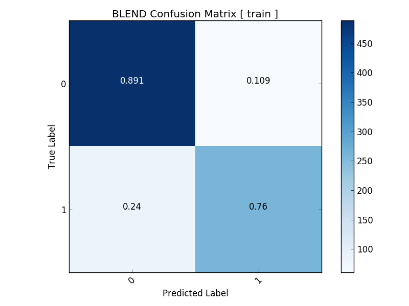
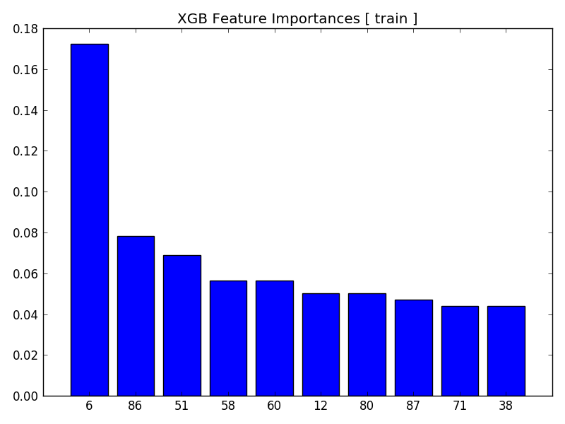
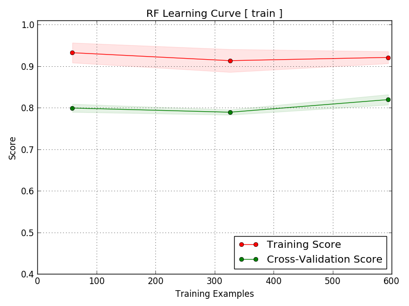
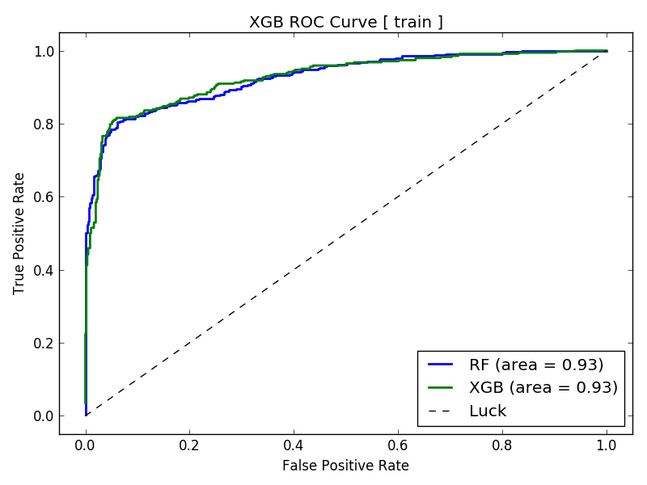

AlphaPy
=======

.. image:: model_pipeline.png
   :alt: AlphaPy Model Pipeline
   :width: 100%
   :align: center

Model Object Creation
---------------------

**AlphaPy** first reads the ``model.yml`` file and then displays
the model parameters as confirmation that the file was read
successfully. As shown in the example below, the Random Forest
(RF) and XGBoost (XGB) algorithms are used to build the model.
From the model specifications, a ``Model`` object will be
created.

All of the model parameters are listed in alphabetical order.
At a minimum, scan for ``algorithms``, ``features``, ``model_type``,
and ``target`` to verify their accuracy, i.e., that you are
running the right model. The ``verbosity`` parameter will control
the degree of output that you see when running the pipeline.

.. literalinclude:: alphapy.log
   :language: text
   :caption: **alphapy.log**
   :lines: 1-84

Data Ingestion
--------------

Data are loaded from both the training file and the test file.
Any features that you wish to remove from the data are then
dropped. Statistics about the shape of the data and the target
variable proportions are logged.

.. literalinclude:: alphapy.log
   :language: text
   :caption: **alphapy.log**
   :lines: 85-103

Feature Processing
------------------

There are two stages to feature processing. First, you may want
to transform a column of a dataframe into a different format
or break up a feature into its respective components. This is
known as a *treatment*, and it is a one-to-many transformation.
For example, a date feature can be extracted into day, month,
and year.

The next stage is feature type determination, which applies
to all features, regardless of whether or not a treatment has
been previously applied. The unique number of a feature's values
dictates whether or not that feature is a factor. If the
given feature is a factor, then a specific type of encoding
is applied. Otherwise, the feature is generally either text
or a number.

.. image:: features.png
   :alt: Feature Flowchart
   :width: 100%
   :align: center

In the example below, each feature's type is identified along
with the unique number of values. For factors, a specific type
of encoding is selected, as specified in the ``model.yml``
file. For text, you can choose either count vectorization and
TF-IDF or just plain factorization. Numerical features have
both imputation and log-transformation options.

.. literalinclude:: alphapy.log
   :language: text
   :caption: **alphapy.log**
   :lines: 104-172

As AlphaPy runs, you can see the number of new features that are
generated along the way, depending on which features you selected
in the ``features`` section of the ``model.yml`` file. For
interactions, you specify the polynomial degree and the percentage
of the interactions that you would like to retain in the model.
Be careful of the polynomial degree, as the number of interaction
terms is exponential.

.. literalinclude:: alphapy.log
   :language: text
   :caption: **alphapy.log**
   :lines: 173-185

Feature Selection
-----------------

There are two types of feature selection:

* Univariate Selection
* Recursive Feature Elimination (RFE)

Univariate selection finds the informative features based on
a percentile of the highest scores, using a scoring function
such as ANOVA F-Scores or Chi-squared statistics. There are
scoring functions for both classification and regression.

RFE is more time-consuming, but has cross-validation with a
configurable scoring function and step size. We also recommend
using a seed for reproducible results, as the resulting
support vector (a ranking of the features) can vary dramatically
across runs.

.. literalinclude:: alphapy.log
   :language: text
   :caption: **alphapy.log**
   :lines: 195-198

Model Estimation
----------------

A classification model is highly dependent on the class proportions.
If you’re trying to predict a rare pattern with high accuracy,
then training for accuracy will be useless because a dumb classifier
could just predict the majority class and be right most of the time.
As a result, **AlphaPy** gives data scientists the ability to
undersample majority classes or oversample minority classes. There
are even techniques that combine the two, e.g., SMOTE or ensemble
sampling.

Before estimation, we need to apply sampling and possibly
shuffling to improve cross-validation. For example, time series
data is ordered, and you may want to eliminate that dependency.

At the beginning of the estimation phase, we read in all of the
algorithms from the ``algos.yml`` file and then select those
algorithms used in this particular model. The process is
iterative for each algorithm: initial fit, feature selection,
grid search, and final fit.

.. literalinclude:: alphapy.log
   :language: text
   :caption: **alphapy.log**
   :lines: 186-233

Grid Search
-----------

There are two types of grid search for model hyperparameters:

* Full Grid Search
* Randomized Grid Search

A full grid search is exhaustive and can be the most time-consuming
task of the pipeline. We recommend that you save the full grid search
until the end of your model development, and in the interim use a
randomized grid search with a fixed number of iterations. The
results of the top 3 grid searches are ranked by mean validation
score, and the best estimator is saved for making predictions.

.. literalinclude:: alphapy.log
   :language: text
   :caption: **alphapy.log**
   :lines: 199-210

Model Evaluation
----------------

Each model is evaluated using all of the metrics_ available in
*scikit-learn* to give you a sense of how other scoring functions
compare. Metrics are calculated on the training data for every
algorithm. If test labels are present, then metrics are also
calculated for the test data.

.. _metrics: http://scikit-learn.org/stable/modules/model_evaluation.html#common-cases-predefined-values

.. literalinclude:: alphapy.log
   :language: text
   :caption: **alphapy.log**
   :lines: 237-276

Model Selection
---------------

Blended Model
~~~~~~~~~~~~~

.. _ridge: http://scikit-learn.org/stable/modules/generated/sklearn.linear_model.Ridge.html

.. literalinclude:: alphapy.log
   :language: text
   :caption: **alphapy.log**
   :lines: 234-236

Best Model
~~~~~~~~~~

The best model is selected from the score of:

* a model for each algorithm, and
* a *blended* model

Depending on the scoring function, best model selection is
based on whether the score must be minimized or maximized.
For example, the Area Under the Curve (AUC) must be
maximized, and negative log loss must be minimized.

When more than one algorithm is scored in the estimation stage,
the final step is to combine the predictions of each one and
create the blended model, i.e., the predictions from the
independent models are used as training features. For
classification, AlphaPy uses logistic regression, and for
regression, we use ridge_ regression.

.. literalinclude:: alphapy.log
   :language: text
   :caption: **alphapy.log**
   :lines: 276-285

Plot Generation
---------------

The user has the option of generating the following plots:

* Calibration Plot
* Confusion Matrix
* Feature Importances
* Learning Curve
* ROC Curve

All plots are saved to the ``plots`` directory of your project.

.. literalinclude:: alphapy.log
   :language: text
   :caption: **alphapy.log**
   :lines: 285-339

Calibration Plot
~~~~~~~~~~~~~~~~

Confusion Matrix
~~~~~~~~~~~~~~~~

Feature Importances
~~~~~~~~~~~~~~~~~~~

Learning Curve
~~~~~~~~~~~~~~

ROC Curve
~~~~~~~~~

Final Results
-------------

* The model object is stored in Pickle (.pkl) format in the ``models``
  directory of the project. The model is loaded later in prediction mode.
* The feature map is stored in Pickle (.pkl) format in the ``models``
  directory. The feature map is restored for prediction mode.
* Predictions are stored in the project's ``output`` directory.
* Sorted rankings of predictions are stored in ``output``.
* Any submission files are stored in ``output``.

.. literalinclude:: alphapy.log
   :language: text
   :caption: **alphapy.log**
   :lines: 340-351
